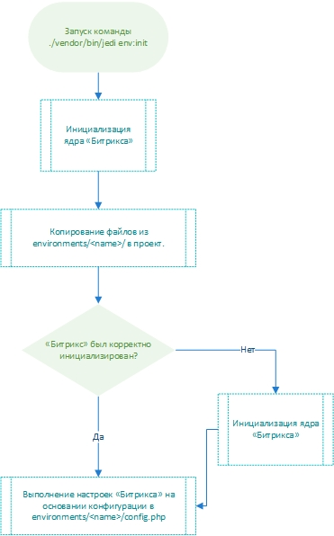

# Continuous Integration

С помощью Console Jedi сочетание слов «Битрикс» и CI становится реальностью: отныне проект можно развернуть и 
настроить одной консольной командой, как в песочнице у разработчика, так и на боевой площадке.

1. [Подключите](install.md) к своему проекту Console Jedi.
2. Настройки «Битрикса», различающиеся в зависимости от окружения (dev, prod), устанавливайте через 
[настройки окружений](environment.md).

Тогда, после выкладки свежего кода на боевую площадку, будет достаточно установить пакеты через Composer и 
применить «боевые» настройки «Битрикса»:

```bash
composer install --no-dev --prefer-dist --no-interaction
./vendor/bin/jedi env:init prod --no-interaction
```

Консольная команда `env:init`, в отличие от [остальных команд](command.md), имеет особый алгоритм выполнения, 
заслуживающий отдельного объяснения:


